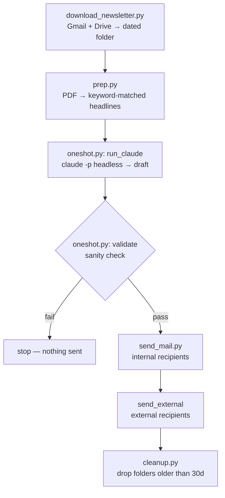

# it-newsletter

A daily IT newsletter that assembles itself: pulls a Korean telecom-association press digest, extracts IT headlines from the PDFs, has an LLM write the summary, checks the output before anyone sees it, and sends.

Runs unattended on weekdays. Started as a local script in June 2026, moved to GitHub Actions in July to drop the PC dependency.

---

## Why

KAIT (Korea Association for ICT Promotion) emails a daily press scrap — several PDFs, no structure, mixed coverage across every industry. Reading it takes twenty minutes and most of it isn't IT. I wanted the five things that mattered, in my inbox, before I opened my laptop.

The interesting part wasn't the summarization. It was everything around it: attachments that arrive two different ways, a runner that forgets its own state, and an LLM whose output goes straight to another person's inbox with nobody looking at it first.

---

## Pipeline



`oneshot.py` orchestrates everything up to delivery. `cleanup.py` runs after, separately — it's housekeeping, not part of the pipeline.

---

## Design notes

These are the decisions that took longer than the code.

**The LLM output passes a deterministic gate before it goes anywhere.**
`validate()` sits between generation and send. If the draft fails the check, the run stops and nothing is delivered — no partial send, no "probably fine." A generated summary that reaches someone else's inbox unreviewed needs a hard boundary between the probabilistic step and the irreversible one. The gate is the boundary.

**Idempotency comes from the sent-mail history, not local state.**
CI runners are ephemeral; a local "already sent today" flag would be gone by the next run, and a lockfile in the repo would need commits back. `gauth.py` queries Gmail's own sent history instead. The record of the side effect *is* the state, so a re-run can't double-send.

**External delivery failure does not roll back internal delivery.**
Internal recipients go first. If the external send then fails, the run doesn't unwind — it reports and exits. Retrying the whole pipeline would resend to people who already got it, which is worse than one missing delivery.

**Retention is tied to upstream availability, not to a round number.**
`cleanup.py` keeps 30 days because KAIT keeps the originals for 30 days. Past that window the local copy is the only copy, and holding it wouldn't help — anything still needed can be re-fetched with `backfill.py`. The number isn't arbitrary; it's the point where local storage stops being a cache and starts being an archive I didn't intend to run.

**Credentials load two different ways from one interface.**
Locally it's `token.json`; on a runner it's an environment variable. `gauth.py` hides the difference so nothing downstream branches on where it's running.

**Attachments arrive two ways.**
Small files come as normal Gmail attachments. Large ones come as links to KAIT's transfer server or as Drive links, which means a second auth scope and a second fetch path. Real inboxes are like this.

**The LLM step uses Claude Code in headless mode.**
`claude -p` with a subscription token rather than a metered API key — no per-call billing to monitor for a job that runs once a day.

---

## Setup

```bash
pip install -r requirements.txt
cp .env.example .env   # fill in
python oneshot.py
```

| Variable | Purpose |
|---|---|
| `GMAIL_TOKEN_JSON` | Full `token.json` contents, for unattended cloud runs |
| `CLAUDE_CODE_OAUTH_TOKEN` | Subscription token for `claude -p` |
| `SENDER_EMAIL` | OAuth login hint / source account |
| `RECIPIENTS` | Internal recipients, comma-separated |
| `NEWSLETTER_EXTERNAL_TO` | External recipients (optional) — `email\|greeting`, `;` separated |
| `NEWSLETTER_EXTERNAL_ONCE` | One-off external recipient (optional) — `YYYYMMDD\|email\|greeting` |
| `NEWSLETTER_GREETING` | Default greeting for external recipients (optional) |
| `TZ` | Timezone — runners are UTC, date matching is not |
| `NEWSLETTER_OUT` | Output root (optional) |

Requires Gmail API (`gmail.send`, `gmail.readonly`) and Drive API (`drive.readonly`) enabled on a Google Cloud project, with OAuth credentials.

---

## Files

| File | Role |
|---|---|
| `oneshot.py` | Orchestrator — download through send |
| `download_newsletter.py` | Fetches attachments, including Drive and transfer-server links |
| `prep.py` | PDF → IT-keyword-matched headline text |
| `send_mail.py` | Markdown body → Gmail API, internal and external recipients |
| `gauth.py` | Credential loading + duplicate-send detection |
| `backfill.py` | Retroactive fetch, last 30 days, skips existing |
| `cleanup.py` | Deletes dated folders past the retention window |
| `run_daily.bat` | Local scheduled run |
| `Dockerfile` | Container build |

---

## Scope

This is a public mirror for reference. The scheduled trigger is removed — only `workflow_dispatch` remains — and no recipients are configured. Live delivery runs from a separate private repository.

Written for one specific upstream source, so it won't work as-is on a different digest. The parts worth reusing are the validation gate, the history-based idempotency check, and the dual-mode credential loader.
